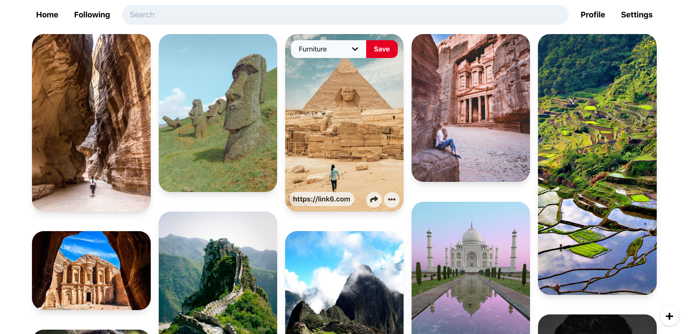

# Pinterest Clone
A clone of the original [pinterest](https://pinterest.com) site written using React and Django Rest Framework. You may see the live version [here](https://pinterest-clone.portfolio.ricardoramos.me).


Potentially Includes:
1. Codebase
2. Background jobs
3. Environment Configurations for Dev, Test and/or Prod
4. Containerized Applications
5. Testing
6. CI/CD deployment

### Features
1. Login and Account Creation
2. Create boards to store pins
3. Create own pins
4. Add other people's pins into own boards
5. Follow and unfollow other people
6. Pins filtered by all, by followers, by user, etc.
7. Edit User Settings
8. Infinite Scroll and lazy loading of pins in masonry layout

## How to run locally
```bash
git clone https://github.com/imricardoramos/portfolio.git
cd pinterest-clone
docker-compose up
```
Finally open up https://altpins.portfolio.ricardoramos.localhost
